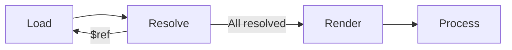
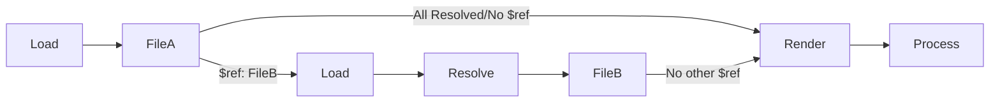

# CodeGenR


## Installation

Install Rust : https://www.rust-lang.org/tools/install.
And then install `codegenr`

```
cargo install codegenr
```

or install the development version

```
cargo install --git https://github.com/eventuallyconsultant/codegenr --branch dev
```

## Documentation

[codegenr documentation on docs.rs](https://docs.rs/codegenr/latest)

### Codegen Steps
Here is a simple folders/files Tree we're gonna use in example
```
|- _specs
        |- openapi.yaml
        |- ...
|- _templates
            |- rest-tests
                        |- mytemplate.hbs
                        |- ...
|- _rest-calls
            |- generated
                      |- file1
                      |- ...
```



#### codegenr.toml
To generate your files, you need to define  these parameters :
- `[section_name]` : A unique name reprensting each section
- `source` : The file.yaml with the data you want to use for the genration
- `templates` : the file.hbs (handlebar template) you're using to generate the file with your data
- `output` : The Folder where the "generated" folder with the files will be generated.
- `custom_helpers` : 
- `intermediate` : Codegenr
- `global_parameters` : (Optionnal) Some parameters you want to use in the helpers.

Here is an example of a section in the codegenr.toml. 
```toml
[api_section]
source = "./_specs/openapi.yaml"
templates = [ "./_templates/misc/rest-tests" ]
output = "./_rest-calls"
custom_helpers = [ "./_templates/_custom_helpers" ]
intermediate = "codegenr"
global_parameters =  { apiName = "MyFirstApi", apiRoot = "/v1/api" }
```

#### Here is the `openapi.yaml` example file:
```yaml
openapi: 3.0.3
info:
  title: Example openapi
  description: "Openapi specifications"
  version: 1.0.0
servers:
  - url: http://localhost:8000
paths:
  /me:
    get:
      tags:
        - user
      summary: Get current users informations
      operationId: get_current_user
      responses:
        "200":
          description: Successful operation
          content:
            application/json:
              schema:
                $ref: "#/components/schemas/GetMeResponse"
...
components:
  schemas:
    GetMeResponse:
      type: object
      required:
        - username
      properties:
        username:
          type: string
          description: a username/handle
          example: just_a_username

```

#### Load
- The source file(s) will be `load` completely the actual file and find all possible references (`$ref: "..."`)in order to load recursively these files and their refs (if maybe they have some) and have all files needed load.
- If you look closely to the `openapi.yaml` file above, you can see that `$ref: "#/components/schemas/EmptyResponse"` refer to a specific path composed in 3 parts:
- - The `#` means in this document
- - The `/components/schemas/` is the path in the file
- - The `EmptyResponse` is the object we're looking for, here is just a simple example with a description and a type.

#### Resolve
- If the loader find a `$ref: "..."`, the resolver will try to find the file with the path and resolve the file recursively for how much ref there is in all necessary files within the end.
- In this example, if the loader find a `$ref` in the fileA which is redirecting in the FileB, the loader will try to load the fileB and resolve the reference that the `$ref` is pointing.
- After resolving the ref, the loader will try to find if there is other $ref in the first file or even the file(s) loaded with the ref(s) and so recursively load and resolve them in order to load all the necessary files.
- Finally, when all the refs are resolved and all necessary files loaded, the render and process will do their job.


#### Render

Here is our handlebar example file named `mytemplate.hbs` which is in the `./_templates/misc/rest-tests` folder.
```handlebars
{{set "fileName" (snake_case (global_parameter "apiName")) }}

### FILE {{ get "fileName" }}.generated.rest

@host = localhost
@port = 8000
@api_root = {{global_parameter "apiRoot"}}

{{#each paths}}{{#with_set "path" @key}}
{{#each this}}{{#with_set "httpMethod" @key}}
# {{operationId}}
# --- --- --- --- --- --- --- --- --- --- --- ---
{{get "httpMethod"}} http://\{{host}}:\{{port}}\{{api_root}}{{get "path"}} HTTP/1.1

{{/with_set}}{{/each}}
{{/with_set}}{{/each}}

### /FILE
```

- The render will use the template folder u defined (`./_templates/misc/rest-tests`in the example above) to find all handlebars files (mytemplate.hbs, ...) and render them using the parameters defined in the `global_parameters` part if there is some.
- In we follow the example above, here is what the render will do :
- - It will define the variable `fileName` using the `snake_case` helper and the `global parameter` named `apiName` which is "MyFirstApi" as we defined it in our example.
```toml
global_parameters =  { apiName = "MyFirstApi", apiRoot = "/v1/api" }
```
- - Then it will use the `fileName` variable to define his file name, here it will be `my_first_api.generated.rest`.
- - Just after this, we define some few parameters of our API which we're gonna use later such as the host, the port and the api_root which is using the `apiRoot` global parameter we defined 
```toml
global_parameters =  { apiName = "MyFirstApi", apiRoot = "/v1/api" }
```
- - We're now iterating with the helper `each` for each item contained in the `paths` section of the `openapi.yaml` file and set each path as a variable @key (with the `with_set` helper) contained in each `path` we will iterate in the `paths`. (here it will be our first path `/me`)
```yaml
...
paths:
  /me:
...
```
- - Next we're gonna iterate again to the next item contained in the item `this` representing the path we just iterated before and set this as as the `httpMethod` of the `@key`. (Here this is representing the `get` method)
```yaml
...
paths:
  /me:
    get:
...
```
- - To continue, we're gonna write the operation ID contained in this path if it exist. (here it is the `get_me`)

```yaml
...
paths:
  /me:
    get:
      summary: Get my informations
      operationId: get_me
...
```
- - And finally we're gonna write our request using all informations we have such as our `httpMethod`, our `host`, our `port`, the `api_root` and the `path` then close our helpers and define the end of the file.
```handlebars
{{get "httpMethod"}} http://\{{host}}:\{{port}}\{{api_root}}{{get "path"}} HTTP/1.1
```
- Here is what our file will look at the end.
```rest

@host = localhost
@port = 8080
@api_root = /v2/rentals


# get_me
# --- --- --- --- --- --- --- --- --- --- --- ---

get http://{{host}}:{{port}}{{api_root}}/me HTTP/1.1
```
---
- talk about `.rhai` files
#### Process

## Helpers

The defaults handlebars helpers (`eq`, `ne`, `gt`, `gte`, `lt`, `lte`, `and`, `or`, `not` ...) are provided by the rust handlebars implementation : https://docs.rs/handlebars/latest/handlebars/#built-in-helpers

Other handlebars helpers are provided by the `handlebars_misc_helpers` crate : https://github.com/davidB/handlebars_misc_helpers

Some more helpers are added by `this project` and are documented [here](https://docs.rs/codegenr/latest/codegenr/helpers/index.html).

Finally you can add your own custom helpers at runtime using the [rhai embedded scripting language](https://rhai.rs/)

## Contribute

You can also open the repository in GitPod with this button
[](https://gitpod.io/#https://github.com/eventuallyconsultant/codegenr)

In the command line you can :

- `cargo test` to launch all the unit tests
- `cargo doc --open` to compile and open the local documentation

## Some command lines

- `cargo doc --open` compile and open the documentation
- `cargo install --path codegenr` installs codegenr command line from sources
- `cargo install --git https://github.com/eventuallyconsultant/codegenr --branch dev` installs codegenr command line from the latest github `dev` branch

## Legacy

This tool is based on the design of a precedent one written in `C#` : [CodegenUP](https://github.com/BeezUP/dotnet-codegen).

## Roadmap :

- [x] Load a yaml or json to serde::json
- [x] Resolve `$ref` tags
- [x] Pass all the resulting document to an handlebar template
- [x] Implement some default helper (and make some doc tests about them)
- [x] A plugin system
- [x] Migrate C# custom helpers to this new plugin system
- [x] A this point, we could use `codegenr` in place of `CodegenUP`, just by calling some commands
- [x] Rename `codegenr-cli` to `codegenr` & `codegenr` to `codegenr-lib`
- [x] Publish on `crates.io`
- [x] Be able to have a `codegenr.toml` on a workspace root to describe all the templates to execute around the workspace
- [x] Better Errors (typed ones)
- [x] Resolved Json Cache optimisation
- [x] all tests passing on windows too
- [ ] Verbose/Tracing? mode
- [ ] Better examples
- [ ] Smol strings optimisation ?
- [ ] Watch mode for the file changes
- [ ] Make a VSCode extension about all of this to make it live / super user friendly for `everyone`

- [ ] Allow multiple swagger2 documents merging
- [ ] Allow multiple swagger3 documents merging
- [ ] Transform the json to an [OpenApi Generator](https://openapi-generator.tech/) model, and be able to use all the `OpenApi Generator` templates ?
