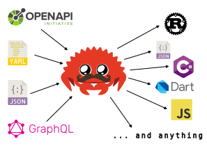
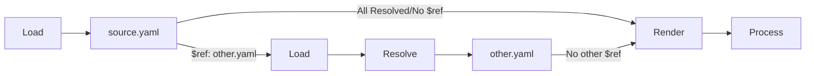

# CodeGenR



## Installation

Install Rust : https://www.rust-lang.org/tools/install.
And then install `codegenr`

```
cargo install codegenr
```

or install the development version

```
cargo install --git https://github.com/eventuallyconsultant/codegenr --branch dev
```

## Documentation

[codegenr documentation on docs.rs](https://docs.rs/codegenr/latest)

### Codegen Steps

Here is a simple folders/files Tree we're gonna use in example

```
|- _specs
  |- openapi.yaml
  |- ...
|- _templates
    |- rest-tests
      |- mytemplate.hbs
      |- ...
|- _rest-calls
  |- generated
    |- file1
    |- ...
```


#### codegenr.toml

To generate your files, you need to define these parameters :

- `[section_name]` : A unique name reprensting each section
- `source` : The file.yaml with the data you want to use for the generation
- `templates` : the folders containing handlebar templates (`.hbs`) you're using. Only one file in those folders must not be prefixed by `_` and then is considered as the `main` template. The other ones are prefixed like `_partial.hbs` are considered `partial` templates.
- `output` : The `root folder` where the files will be generated. All files output path write will be computed from this root.
- `custom_helpers` : A place you can put `.rhai` file, each file is loaded as a custom helper, usable from the `.hbs` templates
- `intermediate` : (Optionnal) if set, `codegenr` will output intermediate files for debug purpose
- `global_parameters` : (Optionnal) Some values you want to use with the `global_parameter` helper.

##### Here is an example of a section in the `codegenr.toml`.

```toml
[api_section]
source = "./_specs/openapi.yaml"
templates = [ "./_templates/misc/rest-tests" ]
output = "./_rest-calls"
custom_helpers = [ "./_templates/_custom_helpers" ]
intermediate = "codegenr"
global_parameters =  { apiName = "MyFirstApi", apiRoot = "/v1/api" }
```

#### Load

The `load` step will read the `source` file and turn it to json

- if it's a `json` file, it's quite easy
- if it's a `yaml` file, it's not that hard
- if it's a `graphql` sdl file, it's lead to some structure changes

If you look closely to example below, you can see that `$ref: "#/components/schemas/GetMeResponse"` refer to a specific path composed in 3 parts:

- The `#` part is refering to the `same` document (Also: `file.yaml#...` would be referring to the document `file.yaml`)
- `/components/schemas/` is the path `in` the file
- `GetMeResponse` is the object we're looking for, here is just a simple example with a property `username` which contains a description and a type.

```yaml
# `some_openapi_file.yaml` example
openapi: 3.0.3
info:
  title: Example openapi
  description: "Openapi specifications"
  version: 1.0.0
servers:
  - url: http://localhost:8000
paths:
  /me:
    get:
      tags:
        - user
      summary: Get current users informations
      operationId: get_current_user
      responses:
        "200":
          description: Successful operation
          content:
            application/json:
              schema:
                $ref: "#/components/schemas/GetMeResponse"
# ...
# ...
components:
  schemas:
    GetMeResponse:
      type: object
      required:
        - username
      properties:
        username:
          type: string
          description: a username/handle
          example: just_a_username
```

for more information : https://swagger.io/docs/specification/using-ref/

this is where the `resolve` step comes in the game :

#### Resolve

If the file contains from json references (`$ref: "..."`), the resolver will replace the reference by the value pointed at by the reference. If the reference point at another file, it'll be loaded (previous step). Then it will continue to resolve references in the value, and so on, recursively, until all `$ref`s are replaced.

In this example, the loader finds a `$ref` in the `source.yaml` which is redirecting in the `other.yaml`, the loader will then load the `other.yaml` and resolve the reference that the `$ref` is pointing.

```yaml
# source.yaml
openapi: 3.0.3
info:
  title: Example
  description: "Just an example"
  version: 1.0.0
servers:
  - url: http://localhost:8000
paths:
  /user:
    get:
      tags:
        - user
      summary: Get current users informations
      operationId: get_current_user
      responses:
        "200":
          description: Successful operation
          content:
            application/json:
              schema:
                $ref: "other.yaml#/components/schemas/UserResponse"
```

```yaml
# other.yaml
components:
  schemas:
    UserResponse:
      type: object
      required:
        - username
      properties:
        username:
          type: string
          description: a username/handle
          example: just_a_username
```

```json
// all resolved & changed to json
{
  "openapi": "3.0.3",
  "info": {
    "title": "Example",
    "description": "Just an example",
    "version": "1.0.0"
  },
  "servers": [
    {
      "url": "http://localhost:8000"
    }
  ],
  "paths": {
    "/user": {
      "get": {
        "tags": ["user"],
        "summary": "Get current users informations",
        "operationId": "get_current_user",
        "responses": {
          "200": {
            "description": "Successful operation",
            "content": {
              "application/json": {
                "schema": {
                  "UserResponse": {
                    "type": "object",
                    "required": ["username"],
                    "properties": {
                      "username": {
                        "type": "string",
                        "description": "a username/handle",
                        "example": "just_a_username"
                      }
                    },
                    "x-fromRef": "other.yaml#/components/schemas/UserResponse",
                    "x-refName": "UserResponse"
                  }
                }
              }
            }
          }
        }
      }
    }
  }
}
```



Finally, when all the refs are resolved and all necessary files loaded, the render and process will do their job.

#### Render

Here is our handlebar example file named `mytemplate.hbs` which is in the `./_templates/misc/rest-tests` folder. 
The goal of this template will be to ouptut a `.rest` file named after the `apiName`, that contains ready to use
one click examples from the swagger documentation. (usage with [Rest Client VsCode extension](https://marketplace.visualstudio.com/items?itemName=humao.rest-client))

This step will use the template folder you defined (`./_templates/misc/rest-tests` in the example above) to find all handlebars files (`mytemplate.hbs`, ...) 
and render the ONE `.bhs` main file (the one with no `_underscore`) using the `load & resolve` result as source, and the parameters defined in the `global_parameters` if there are some.

for more information about the handlebar syntax : https://handlebarsjs.com/guide/

```handlebars
{{!
In the following example, here is what the render will do :
It will define the variable `fileName` using the `snake_case` helper
and the `global parameter` named `apiName` which is "MyFirstApi" as 
we defined it in our example.

So the value set in `fileName` will be "my_first_api"
}}
{{set "fileName" (snake_case (global_parameter "apiName"))}}

{{!
Then it will reuse the `fileName` variable to output an instruction writing to a file.
Here it will be `my_first_api.generated.rest`.
(The process/processor instructions step will be explained later)
}}
### FILE {{get "fileName"}}.generated.rest

{{!
Thos 3 variables, will be used later by the `.rest` rest client extensions.
`apiRoot` is passed from the `codegenr` call arguments
}}
@host = localhost
@port = 8000
@api_root ={{global_parameter "apiRoot"}}

{{!
We're now iterating with the helper `each` for each item contained
in the "paths" section of the "openapi.yaml" file.
`#each` is a standard handlebars helper. 
Go and RTFM to know more about [handlebars syntax](https://handlebarsjs.com/guide/). 
}}
{{#each paths}}
  {{!
  We set a variable named `path` with the value from `@key`.
  The variable scope will stay until the `with_set` block helper is ended 
  The first iteration will have the value "/user" here.
  }}
  {{#with_set "path" @key}}
    {{!
    Next we'll loop over the current value of the handlebars context: `this`.
    "this" is the openapi path so it's children are http methods.
    So we set the `httpMethod`. 
    }}
    {{#each this}}
    {{#with_set "httpMethod" @key}}
        {{!
        Now we output some nice `.rest` comments, to make it nice to read.
        ex: it's `get_current_user` here
        }}
        # {{operationId}}
        # --- --- --- --- --- --- --- --- --- --- --- ---
        {{!
        Is there a request body json example
        }}
        {{#if requestBody}}
        {{#each requestBody.content}}{{#with_set "contentType" @key}}
        {{#each examples}}
        {{#no_empty_lines}}
        {{!
        We're gonna write our request using all informations we have
        such as our `httpMethod` and `path`.
        Your can see the `\` before `{{host` for example. 
        This is in order to escape the helper, it's a `.rest` variable usage, not a `handlebars` helper call
        }}
        {{get "httpMethod"}} http://\{{host}}:\{{port}}\{{api_root}}{{get "path"}} HTTP/1.1
        content-type: {{get "contentType"}}
        {{/no_empty_lines}}

        {{#each this}}
        {{json_to_str this format="json_pretty"}}
        {{/each}}

        #### --- --- --- ---
        {{/each}}
        {{/with_set}}{{/each}}
        {{else}}
        {{!
        Same with no example
        }}
        {{get "httpMethod"}} http://\{{host}}:\{{port}}\{{api_root}}{{get "path"}} HTTP/1.1

        #### --- --- --- ---
        {{/if}}
        {{get "httpMethod"}}
        http://\{{host}}:\{{port}}\{{api_root}}{{get "path"}}
        HTTP/1.1 

        {{#each this}}
        {{json_to_str this format="json_pretty"}}
        {{/each}}
        #### --- --- --- ---

        {{!
        finally we close all the openned helpers
        }}
      {{/with_set}}
    {{/each}}
  {{/with_set}}
{{/each}}
  
{{!
And the file written
}}
### /FILE
```

Here is what our render output will look at the end.

```rest
@host = localhost
@port = 8080
@api_root = /v1/api

# get_me
# --- --- --- --- --- --- --- --- --- --- --- ---

get http://{{host}}:{{port}}{{api_root}}/user HTTP/1.1
#### --- --- --- ---
```

#### Helpers

Handlebars is a pretty limited language, but it's extended with `helpers` :
- it has some standard helpers (`eq`, `ne`, `gt`, `gte`, `lt`, `lte`, `and`, `or`, `not` ...), provided by the rust handlebars implementation : https://docs.rs/handlebars/latest/handlebars/#built-in-helpers
- `codegenr` bundles the `handlebars_misc_helpers` to have more helpers : https://github.com/davidB/handlebars_misc_helpers
- `codegenr` also provides some more home backed helpers : https://docs.rs/codegenr/latest/codegenr/helpers/index.html
- **Finally** `you` can add your own helpers using the [rhai embedded scripting language](https://rhai.rs/)
  - any `__myhelper__.rhai` file in the custom_helpers folder will be available as a `myhelper` handlebars inline helper, usable from the .hbs templates.

Here is a simple example and what it is used for:

This yaml fragment is the definition of a response in your `file.yaml`, you can see that we defined for the `userCount` property the type and the format.
This property is also marked as `required` in the required array.

```yaml
DisplayUserCount:
  description: Display the number of user
  type: object
  required:
    - userCount
  properties:
    userCount:
      type: integer
      format: uint64
```

Now imagine you want to generate some `dart client` for this api, you now have to convert this property type to a type in `Dart`.
In this case, we can use the rhai file to perform this complex mapping : `dart_type_convert.rhai`
It will define a helper with 3 parameters :
- `type`: we'll provide the type value (`"integer"` here)
- `format`: we'll provide the format value (`"uint64"` here)
- `optional`: we'll need to use the `is_oapi3_property_required` codegenr helper and negate it with `not` to pass `true` is the parameter is not found in the `required` array.

```handlebars
{{ dart_type_convert type format (not(is_oapi3_property_required @key ../required)) }}
```

will output

```dart
int
```

Thanks to this custom `rhai` helper :

```rhai
// dart_type_convert.rhai
let type = params[0];
let format = params[1];
let optional = if params.len() > 2 { params[2] } else { false };

// For more information about the data types, check the swagger doc
// https://swagger.io/docs/specification/data-models/data-types/

let type_name = switch [type, format] {
  ["string", ""] => "String",
  ["integer", "uint32"] => "int",
  ["integer", "uint64"] => "int",
  ["number", "float"] => "double",
  ["number", "double"] => "double",
  _ => {
    throw `UNKNOWN TYPE ${type} - ${format}`;
    ()
  }
};

if optional {
  `${type_name}?`
}else{
  type_name
}

```


#### Process

The `process` step is where the `render` output is took from memory to files or console ...

Files will written by following the instructions defined in handlebars template between `### FILE` and `### /FILE`.

Some very simple example here :

```yaml
# source.yaml
fileName: test
```
```handlebars
{{! template.hbs }}
### FILE {{fileName}}.txt 
Hello
### /FILE
### CONSOLE 
World !
### /CONSOLE
```
`shell output`
```sh
World !
```
`text.txt`
```txt
Hello
```

## Contribute

You can also open the repository in GitPod with this button
[](https://gitpod.io/#https://github.com/eventuallyconsultant/codegenr)

In the command line you can :

- `cargo test` to launch all the unit tests
- `cargo doc --open` to compile and open the local documentation

## Some command lines

- `cargo doc --open` compile and open the documentation
- `cargo install --path codegenr` installs codegenr command line from sources
- `cargo install --git https://github.com/eventuallyconsultant/codegenr --branch dev` installs codegenr command line from the latest github `dev` branch

## Legacy

This tool is based on the design of a precedent one written in `C#` : [CodegenUP](https://github.com/BeezUP/dotnet-codegen).

## Roadmap :

- [x] Load a yaml or json to serde::json
- [x] Resolve `$ref` tags
- [x] Pass all the resulting document to an handlebar template
- [x] Implement some default helper (and make some doc tests about them)
- [x] A plugin system
- [x] Migrate C# custom helpers to this new plugin system
- [x] A this point, we could use `codegenr` in place of `CodegenUP`, just by calling some commands
- [x] Rename `codegenr-cli` to `codegenr` & `codegenr` to `codegenr-lib`
- [x] Publish on `crates.io`
- [x] Be able to have a `codegenr.toml` on a workspace root to describe all the templates to execute around the workspace
- [x] Better Errors (typed ones)
- [x] Resolved Json Cache optimisation
- [x] all tests passing on windows too
- [ ] Verbose/Tracing? mode
- [ ] Better examples
- [ ] Smol strings optimisation ?
- [ ] Watch mode for the file changes
- [ ] Make a VSCode extension about all of this to make it live / super user friendly for `everyone`

- [ ] Allow multiple swagger2 documents merging
- [ ] Allow multiple swagger3 documents merging
- [ ] Transform the json to an [OpenApi Generator](https://openapi-generator.tech/) model, and be able to use all the `OpenApi Generator` templates ?
