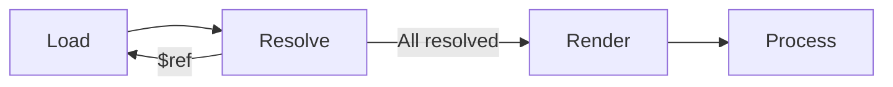
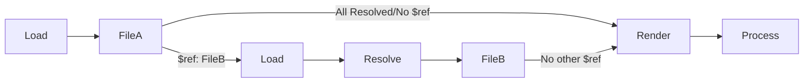

# CodeGenR


## Installation

Install Rust : https://www.rust-lang.org/tools/install.
And then install `codegenr`

```
cargo install codegenr
```

or install the development version

```
cargo install --git https://github.com/eventuallyconsultant/codegenr --branch dev
```

## Documentation

[codegenr documentation on docs.rs](https://docs.rs/codegenr/latest)

### Codegen Steps
Here is a simple folders/files Tree we're gonna use in example
```
|- _specs
        |- openapi.yaml
        |- ...
|- _templates
            |- rest-tests
                        |- yourtemplate.hbs
                        |- ...
|- _rest-calls
            |- generated
                      |- file1
                      |- ...
```



#### codegenr.toml
To generate your files, you need to define  these parameters :
- `[section_name]` : A unique name reprensting each section
- `source` : The file.yaml with the data you want to use for the genration
- `templates` : the file.hbs (handlebar template) you're using to generate the file with your data
- `output` : The Folder where the "generated" folder with the files will be generated.
- `custom_helpers` : 
- `intermediate` : Codegenr
- `global_parameters` : (Optionnal) Some parameters you want to use in the helpers.

Here is an example of a section in the codegenr.toml. 
```toml
[api_section]
source = "./_specs/openapi.yaml"
templates = [ "./_templates/misc/rest-tests" ]
output = "./_rest-calls"
custom_helpers = [ "./_templates/_custom_helpers" ]
intermediate = "codegenr"
global_parameters =  { apiName = "Api", apiRoot = "/v2/api" }
```

Here is the yaml example file:
```yaml
openapi: 3.0.3
info:
  title: Example openapi
  description: "Openapi specifications"
  version: 1.0.0
servers:
  - url: http://localhost:8000/api/v2
paths:
  "/":
    get:
      summary: Display the index page
      operationId: index
      responses:
        "200":
          description: Ok
          x-template: index.html
          content:
            text/html:
              schema:
                $ref: "#/components/schemas/EmptyResponse"
...
components:
  schemas:
    EmptyResponse:
      description: Nothing special to show on this page, only the template
      type: object
```

#### Load
- The source file(s) will be `load` completely and find all possible references

#### Resolve
- If the loader find a `$ref: "..."`, the resolver will try to find the file with the path and resolve the file recursively for how much ref there is in all necessary files within the end.


#### Render

- talk about `.hbs` files
- talk about `.rhai` files

#### Process

## Helpers

The defaults handlebars helpers (`eq`, `ne`, `gt`, `gte`, `lt`, `lte`, `and`, `or`, `not` ...) are provided by the rust handlebars implementation : https://docs.rs/handlebars/latest/handlebars/#built-in-helpers

Other handlebars helpers are provided by the `handlebars_misc_helpers` crate : https://github.com/davidB/handlebars_misc_helpers

Some more helpers are added by `this project` and are documented [here](https://docs.rs/codegenr/latest/codegenr/helpers/index.html).

Finally you can add your own custom helpers at runtime using the [rhai embedded scripting language](https://rhai.rs/)

## Contribute

You can also open the repository in GitPod with this button
[](https://gitpod.io/#https://github.com/eventuallyconsultant/codegenr)

In the command line you can :

- `cargo test` to launch all the unit tests
- `cargo doc --open` to compile and open the local documentation

## Some command lines

- `cargo doc --open` compile and open the documentation
- `cargo install --path codegenr` installs codegenr command line from sources
- `cargo install --git https://github.com/eventuallyconsultant/codegenr --branch dev` installs codegenr command line from the latest github `dev` branch

## Legacy

This tool is based on the design of a precedent one written in `C#` : [CodegenUP](https://github.com/BeezUP/dotnet-codegen).

## Roadmap :

- [x] Load a yaml or json to serde::json
- [x] Resolve `$ref` tags
- [x] Pass all the resulting document to an handlebar template
- [x] Implement some default helper (and make some doc tests about them)
- [x] A plugin system
- [x] Migrate C# custom helpers to this new plugin system
- [x] A this point, we could use `codegenr` in place of `CodegenUP`, just by calling some commands
- [x] Rename `codegenr-cli` to `codegenr` & `codegenr` to `codegenr-lib`
- [x] Publish on `crates.io`
- [x] Be able to have a `codegenr.toml` on a workspace root to describe all the templates to execute around the workspace
- [x] Better Errors (typed ones)
- [x] Resolved Json Cache optimisation
- [x] all tests passing on windows too
- [ ] Verbose/Tracing? mode
- [ ] Better examples
- [ ] Smol strings optimisation ?
- [ ] Watch mode for the file changes
- [ ] Make a VSCode extension about all of this to make it live / super user friendly for `everyone`

- [ ] Allow multiple swagger2 documents merging
- [ ] Allow multiple swagger3 documents merging
- [ ] Transform the json to an [OpenApi Generator](https://openapi-generator.tech/) model, and be able to use all the `OpenApi Generator` templates ?
